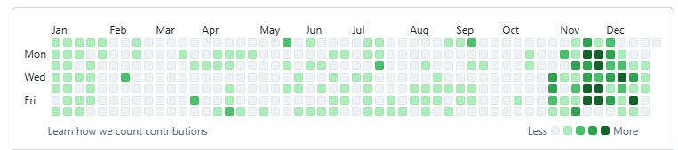

# 👋 Hey, I'm Rupam

**SDE-2 Full Stack Developer** @ Euromonitor International  
*Building intelligent systems with LLMs, RAG & multi-agent pipelines*

## 📊 Contribution Activity

## 🚀 The Shift

Transitioning from traditional full-stack web development to **AI engineering**—leveraging production software architecture to build intelligent systems that **think**, **reason**, and **autonomously solve** complex problems.

## 📌 Current Projects

### 🌟 Open-Source Projects

Actively maintaining and contributing to community-driven AI initiatives:

- **[OpenMAIC](https://github.com/THU-MAIC/OpenMAIC)** ⭐ 30,695 | 🔗 5,095  
  Open Multi-Agent Interactive Classroom — Get an immersive, multi-agent learning experience in just one click

- **[diagram-design](https://github.com/cathrynlavery/diagram-design)** ⭐ 29,893 | 🔗 1,917  
  38 editorial diagram types for Claude Code, Codex, and Pi. Self-contained HTML + SVG. No shadows. No Mermaid slop.

- **[docling](https://github.com/docling-project/docling)** ⭐ 65,916 | 🔗 4,740 (Most starred!)  
  Get your documents ready for gen AI

### � Other Notable Projects

Exploring emerging patterns in agentic AI, workflow automation, and multimodal systems:

- **[ai-cookbook](https://github.com/Rupam0710/ai-cookbook)** — Practical, code-first AI engineering recipes covering LLM APIs, RAG pipelines, document extraction, and conversational AI
- **[ResearchSwarm](https://github.com/Rupam0710/-ResearchSwarm-Multi-Agent-Deep-Research-Engine)** — A swarm of specialized AI agents that collectively researches complex topics and produces structured, cited synthesis reports
- **[Open-Knowledge-Format-OKF](https://github.com/Rupam0710/Open-Knowledge-Format-OKF-)** — A curated knowledge base documenting Google Cloud's open specification for portable metadata and context
- **[AI-Skin-Specialist](https://github.com/Rupam0710/AI-Skin-Specialist)** — Multimodal healthcare assistant combining voice, image, and video analysis with conversational AI guidance
- **[django-celery-redis-async-tasks](https://github.com/Rupam0710/django-celery-redis-async-tasks)** — Async task queue patterns with Django, Celery & Redis — foundational architecture for AI agent frameworks
- **[agentic-ai-with-pydantic-ai](https://github.com/Rupam0710/agentic-ai-with-pydantic-ai)** — Type-safe, production-grade LLM agents with structured outputs, dependency injection, and tool use
- **[Job-Hunter-Agent](https://github.com/Rupam0710/Job-Hunter-Agent)** — AI agent that searches LinkedIn, Naukri, Wellfound and Cutshort in parallel with scored job matches

## 🤝 Open Source & Collaboration

I enjoy building in public, sharing practical AI patterns, and contributing to tools that make intelligent systems more useful and accessible.

### ✨ Community & experimentation
- Building reusable AI architecture patterns and prototypes
- Exploring practical LLM integrations for production-ready systems
- Sharing learnings around agents, RAG, evaluation, and multimodal experiences

## 🛠️ Tech Stack

### 💼 By Day

### 🌙 By Night (AI & LLMs)

**Specializations:** RAG Pipelines · Multi-Agent Systems · Document Processing · Multimodal AI

## 🔗 Let's Connect

| Platform | Link |
|----------|------|
| 🌐 **Portfolio** | [rupampalportfolio.netlify.app](https://rupampalportfolio.netlify.app/) |
| 💻 **GitHub** | [@Rupam0710](https://github.com/Rupam0710) |
| 💼 **LinkedIn** | [Rupam Pal](https://linkedin.com/in/rupam-pal-0213a31a9) |

## ⚡ What Drives Me

- 🎯 Building **production-grade AI systems** that blend reliability with innovation
- 🔒 Type-safe LLM applications that scale
- 🤖 Scalable multi-agent architectures solving real problems
- 📦 Full-stack development with modern frameworks
- 🌟 Open-source contributions that matter

### **Let's build something extraordinary together!** 🚀

*Exploring the intersection of software engineering and artificial intelligence*

